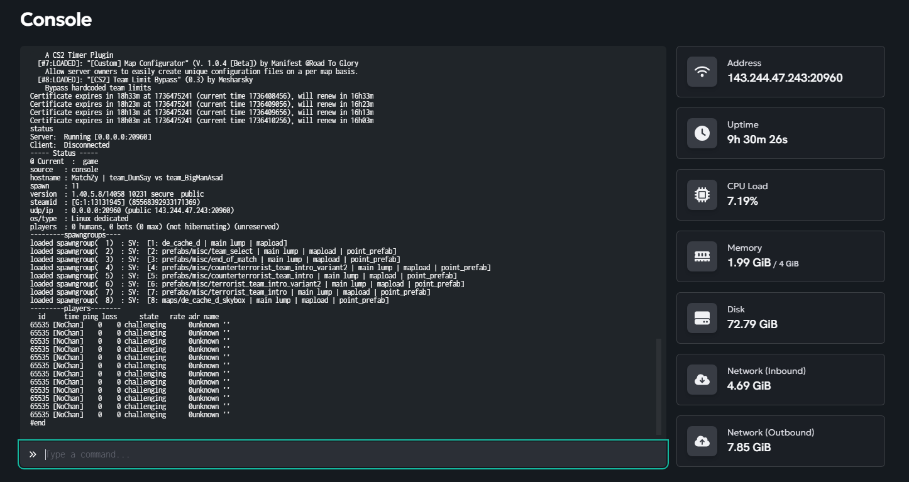

# **Ultrapanels Admin Guide**

#  **Restart Server**

Press the restart button to restart the server. The server will automatically load into `de_dust2`

# **Common Console Commands**

The console panel is where you will issue **steamCMD** commands into the server. These commands are the same commands you would type into your local console i.e. `sv_cheats 1`

Some of the more common commands include:

 `changelevel <map_name>` \- Used to change the server's map to a map installed into the server. This currently only works for the native de\_ maps like `de_dust2` and not any workshop maps (for now).

`host_workshop_map <workshop_id>` \- Used to change the server's map to a workshop map. If the server has already downloaded the map, the map will change immediately, otherwise it will take some time to download. (There doesn't seem to be any console logs to see this). You can find the workshop id by looking in the url of the workshop page.

`sv_cheats 1` \- used to turn on cheats, this is mostly for turning on noclip.

 `say` \- used to send a console message to the server that the entire server can see, can be tough to see replies if game is going on in console (thinking of getting a plugin that sends chats to discord)

`exec <gamemode_gametype>` \- used to force the server to load a specific game mode's config. Right now the `!cs` runs `exec gamemode_competitive` while `!dm` runs `exec gamemode_deathmatch`. I removed the `!surf` command for now but if the map gets into surf and gets screwed up you can run `exec gamemode_surf` to force exec the surf config.

`status` \- prints to the console a list of players, the current map, etc.

`banid <minutes> <userid>` \- ban's userid (from status) for specified minutes. set minutes to `0` to ban indefinitely. i.e. `ban 0 123456`

`css_plugins list` \- shows the currently loaded **CounterStrikeSharp** plugins. Good to debug if a new plugin is loaded or not.

# **MatchZy Admins**

As MatchZy admins you can use these commands in-game to force certain events to happen.

 `.forcestart` \- forces a match to start into knife round, use this when people aren't readying up (min 4 players atm)

`.restart` \- forces the current match to restart to warmup

`.prac` \- puts the game into practice mode

`.exitprac` \- exits the game out of practice mode

`.pause` \- pauses the current freezetime or next round's freezetime

[https://shobhit-pathak.github.io/MatchZy/commands/](https://shobhit-pathak.github.io/MatchZy/commands/) \- more commands/configs

# **Match Config Files**

Navigate to this folder to see the confg files \- these configs get executed when the map changes or when the server restarts. Currently we use the `gamemode_competitive.cfg` mode for regular cs and `gamemode_deathmatch.cfg`.

For **MatchZy** the config files for warmup, knife, live, etc are in here:

The same lines you would enter in the console to change variables are the same lines you add to the config.

This website is awful ads but its actually the best place to look up commands [https://totalcsgo.com/commands](https://totalcsgo.com/commands)

# **Map/Prefix Specific Configs**

One of the plugins we have installed lets us also override configs specifically set for maps. The prefixes are for any maps that start with prefixes like `de_*` or `surf_*`. Forced is for specific map configs. Right now in the configs we just have things like forcing the game mode to switch to cs or dm depending on the map load. Sometimes the workshop maps don't load the prefix configs correctly so you might need to make a forced config for a new map. In the `de_` prefix config we currently disable the **SurfTimer** and vice versa for `surf_` maps.

# **Addons & Plugins**

Currently we run two addons \- **CounterStrikeSharp** and **Metamod**. These two addons have their own plugins we install that do things like add the `rtv` command or `SurfTimer`.

Most likely you will be dealing with the `counterstrikesharp` folder.

Quick TLDR for all the plugins:

* **CustomCommands** \- this is for setting up chat commands like `!dm` or `!cs`. a more detailed section will be below.  
* **FullTeamFix** \- this plugin is supposedly fixing the team size issue combined with setting the gamemode into casual (despite execing the competitive gamemode cfg)  
* **MapConfigurator** \- this plugin gives us the prefix and forced map configs that lets us run specific configs for maps or prefixes like `de_`  
* **MatchZy** \- this is the scrim plugin  
* **TeamLimitBypass** \- this is another plugin supposedly fixing team size, might delete one of these to see if issue still exists  
* **RockTheVote** \- this allows us to have next maps, rtv, etc. a more detailed section will be below.  
* **SharpTimer** \- this is the surf timer plugin, I haven't touched this config at all but might be worth looking into  
* **SpawnTools** \- this plugin helps create additional spawns when maps have only 5 per team and more than 5 players are on a team

More plugins being considered will be added in an Server Upgrades ticket.

# **CustomCommands**

This `Commands.json` file holds all the currently active chat commands enabled in the server. Adding a new instruction requires adding the command text, title, message, and actual server commands to fire off. There is not a huge guarantee that the commands fire in order as it doesnt appear to be totally asynchronous (discovered this crashing when kicking and adding bots).

 In the same folder there's a `Commands.example.json` that has more detailed examples of server commands.

# **RockTheVote**

RockTheVote is our current way of loading workshop maps into the map rotation. To add a workshop map in this list, give the map a name following a : and then the workshop id. You can find the workshop id by looking at the url of the steam page.

A current roadmap item is to take the surf maps off into their own `!surfrtv` command.

Config for this plugin is located here:

Bug fix for this plugin \- on surf maps when the round ends the RTV command gets disabled for some reason despite the config having everything turned on. 

 
